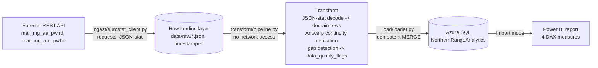
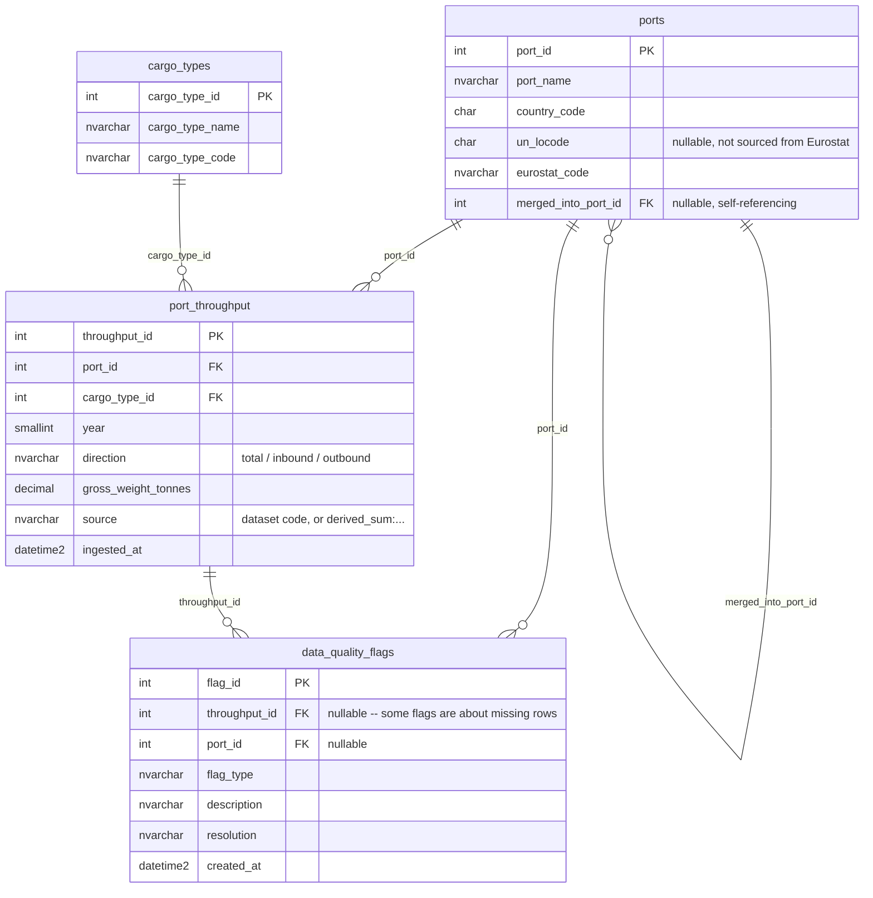
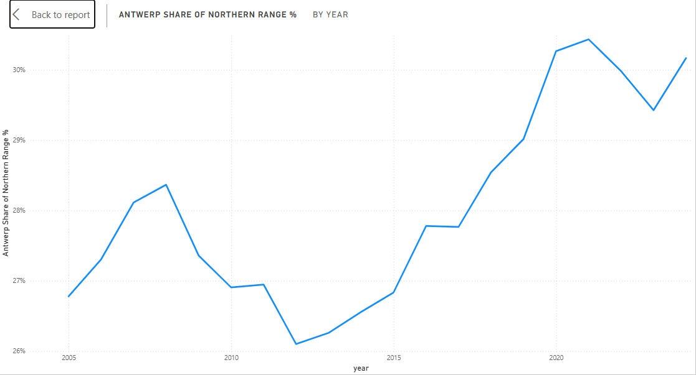
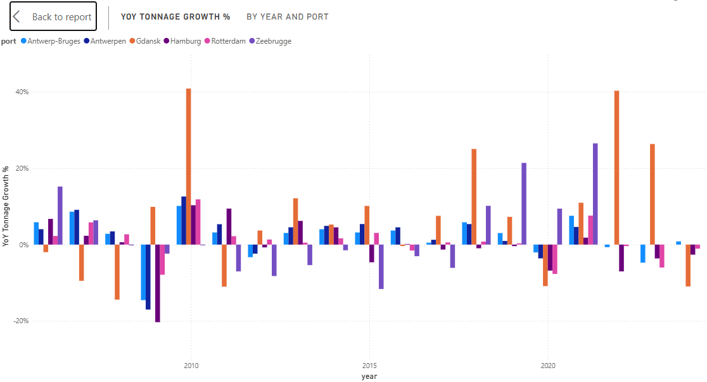
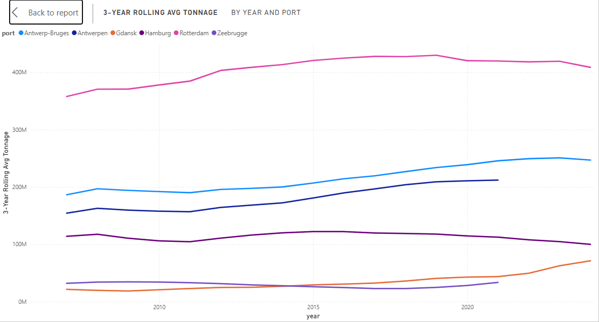
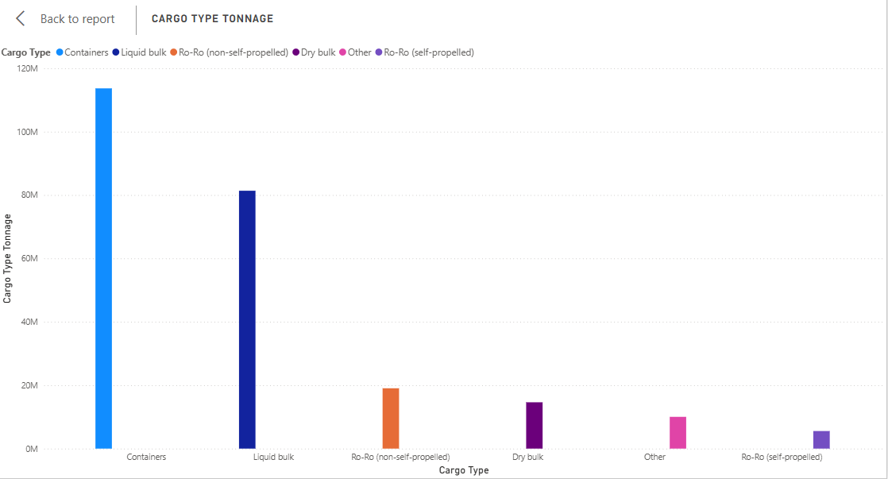

# Northern Range Port Analytics

[](https://github.com/Bergstefann/northern-range-analytics/actions/workflows/ci.yml)

A pipeline against real EU government maritime statistics. How does the Port of
Antwerp-Bruges compare to its Northern Range rivals (Rotterdam, Hamburg, Zeebrugge,
Gdansk) on throughput, and what's driving the trend? Eurostat → Python → Azure SQL →
Power BI, with a port merger that broke the source data mid-series and a real unit bug
caught before it reached the database.

## Architecture



Same structural discipline as the other two projects in this portfolio. The layer that
talks to the outside world (`ingest/`) is separate from the layer that holds business
logic (`transform/`), so the transform is testable without network access. It's scaled
down from Invoicer's full provider-protocol pattern, which suits a project with one
external system instead of three. `ingest/eurostat_client.py` takes an injectable HTTP
session, and that's the only seam this project needs.

Single entrypoint, `port-analytics`, runs all three stages.

## Data model



Genuinely relational, per the build spec. Not one wide flat table. `port_throughput`'s
grain is (port, cargo_type, year, direction): a `cargo_type_code = 'TOTAL'` row per
direction from the direction dataset, plus one row per real cargo-type breakdown at
`direction = 'total'` from the cargo dataset. See `docs/power-bi-measures.md` for why that
grain matters. Summing across it without filtering silently overcounts.

## Try it

```
python -m venv .venv && .venv/Scripts/activate   # or source .venv/bin/activate
pip install -e . ruff mypy pytest pytest-cov types-requests
cp .env.example .env   # fill in the real Azure SQL credentials
port-analytics
```

Requires the [Microsoft ODBC Driver 18 for SQL Server](https://learn.microsoft.com/en-us/sql/connect/odbc/download-odbc-driver-for-sql-server)
installed locally (`pyodbc` links against it). CI installs `unixodbc` on Linux for the
same reason.

Real output from the last verified run:

```
Pulling raw data from Eurostat...
  landed data\raw\mar_mg_aa_pwhd_20260819T091355Z.json
  landed data\raw\mar_mg_am_pwhc_20260819T091356Z.json
Transforming...
  1013 throughput rows, 4 data-quality flags
Loading into Azure SQL...
Loaded: 6 ports, 7 cargo types, 1013 throughput rows, 4 flags (0 revisions detected this run).
```

Run it again and the counts don't move. Every `MERGE` upserts on a natural key, so a
re-run is a no-op unless Eurostat actually changed something. Confirmed directly against
the database, not just inferred from the CLI's own summary: `ports` 6, `cargo_types` 7,
`port_throughput` 1,013, `data_quality_flags` 4, identical across two consecutive runs.

## Data quality

### The bug: thousand-tonnes into a column named `gross_weight_tonnes`

This is the strongest single finding in the project. It isn't a data quirk in someone
else's dataset. It's a real correctness bug in this pipeline's own code, caught before it
ever reached the database.

Eurostat reports the tonnage figure as `THS_T`, meaning **thousand** tonnes. The
transform's first pass (`build_direction_rows`/`build_cargo_rows` in
`transform/throughput.py`) took that raw value and passed it straight into
`PortThroughputRow.gross_weight_tonnes`, a field named as though it held real tonnes and
silently holding thousand-tonnes instead. A 1000x understatement. It shipped through Phase
2's own test suite clean, because the tests were written using Eurostat's raw `THS_T`
figures directly as the expected values. They verified the bug faithfully rather than
catching it.

It surfaced while building the Azure SQL loader, for a boring but effective reason. The
schema column is literally called `gross_weight_tonnes`, and writing the load logic meant
looking straight at that name next to a value like `215852` and asking whether "Antwerpen
handled 215,852 tonnes in 2021" was remotely plausible for a top-5 European port. Antwerpen
alone handled roughly 215 **million** tonnes that year. An honestly-named column is what
made the bug visible. A column called `value` or `amount` would have let it through.

Fixed at the raw → domain boundary (`THOUSAND_TONNES_TO_TONNES = 1000` in
`transform/throughput.py`), not in the loader. The load layer has no business knowing about
source units. `transform/continuity.py` needed no change at all: it only ever sums whatever's
already in `PortThroughputRow.gross_weight_tonnes`, so it inherited the correct values
automatically once the rows feeding it were correct. Every affected Phase 2 test assertion
was updated to the real-tonnes expectation once the bug was understood, not just patched to
make the diff pass.

### Two gaps that are not the same kind of gap

The build spec originally listed `suppressed_confidential` as a `data_quality_flags` type,
alongside `revised_estimate`. Neither has ever fired on real data. That's where the
similarity ends. One is gone because it's structurally impossible to build. The other is
built, tested, and simply hasn't had a real occurrence to detect yet.

**`suppressed_confidential`, removed from the schema, not just unused.** Eurostat's
JSON-stat API exposes no confidentiality flag anywhere in the response: not at the top
level, not per-dimension, not per-value. That was verified by inspecting real API responses
directly, not assumed. A missing (port, year, cargo) combination is indistinguishable
between "confidential", "not collected", and "not applicable" using this API, full stop.
There is no code path this pipeline could add that would ever legitimately populate this
flag from Eurostat's own data. Keeping it in the schema would represent a capability the
pipeline doesn't have and structurally cannot gain from this data source, so it was deleted
from `FlagType` and from the build spec's schema section rather than left as decoration.
**If Eurostat is silently suppressing a confidential figure for one of these ports, this
pipeline cannot tell that apart from the figure simply not existing, and no future version
of this pipeline could either without a different data source.**

**`revised_estimate`, still in the schema, fully implemented, verified with tests, zero
real occurrences so far.** Detecting a revision needs two pulls of the same historical year
to compare. The loader's `port_throughput` MERGE statement (`load/upsert.py`) uses
`OUTPUT $action, inserted.throughput_id, deleted.gross_weight_tonnes,
inserted.gross_weight_tonnes` on every upsert, so it always knows both the old and new
value when a row already exists. `load/loader.py` compares them and emits a
`revised_estimate` flag when a matched row's value changed by more than a floating-point
rounding tolerance. Unit tests against a fake cursor (`tests/unit/test_loader.py`) exercise
both the "value changed" and "value unchanged" cases, so the mechanism is real and correct
independently of whether Eurostat has actually revised anything. It hasn't, in the two real
pulls run so far, seconds apart, so it has correctly reported 0 revisions both times. It's
not a gap in the pipeline. It's a gap in how much time has passed since the pipeline started
watching.

### The Antwerp continuity decision

The single most consequential design decision in this project. Eurostat never published a
unified "Antwerp-Bruges" figure before the 2022 merger. Antwerpen and Zeebrugge reported
separately through 2021 (confirmed directly: both present every year 2005–2021, absent every
year 2022–2024), and the merged entity reports from 2022, with a clean cutover and no
overlap year.

**Decision: keep both views, explicitly, every derived row flagged.** The raw Antwerpen and
Zeebrugge rows are kept untouched under their own port codes, sourced from the real Eurostat
datasets. In addition, a continuous pre-2022 Antwerp-Bruges series is derived by summing the
two legacy ports for every year/cargo-type/direction where both reported a value, stored
under `source = 'derived_sum:BE_0BEANR+BE_0BEZEE'` so it can never be mistaken for a real
Eurostat figure. Verified against the live database: Antwerpen's 2021 total (215,852,000
tonnes) plus Zeebrugge's 2021 total (40,130,000 tonnes) equals Antwerp-Bruges's own derived
2021 row (255,982,000 tonnes) exactly.

Every derived row is backed by a `data_quality_flags` row (`port_merger`) that states this
plainly, rather than the decision living silently inside transform code. Three flags total:
one on Antwerpen, one on Zeebrugge, one on Antwerp-Bruges itself, not one per derived row.
153 derived rows exist, and per-row flagging would mean 153 near-identical rows repeating
the same fact.

**The summation is imperfect, and that's on the flag row itself, not buried in a comment:**
- It assumes Antwerpen's and Zeebrugge's pre-2022 reporting methodologies were compatible
  with each other and with the post-2022 unified authority's. That's unverifiable, since
  Eurostat never published an independent pre-2022 unified figure to check against.
- Any intra-complex traffic both ports separately counted as "goods handled" would be
  double-counted in the sum (unlikely for seaborne cargo statistics specifically, not ruled
  out).
- A future Eurostat revision to the legacy figures would need to be manually re-summed. The
  derived rows have no independent source of their own to be revised against, so
  `revised_estimate` (above) can never fire on them.

This decision is also what makes the headline Power BI measure possible without
special-casing pre/post-2022 in DAX at all. See `docs/power-bi-measures.md`.

### Other findings from the real data

- **Dataset codes in the original plan were wrong.** `mar_mg_am_pwhd` and `mar_go_am` don't
  exist. The real codes are `mar_mg_aa_pwhd` (goods by direction) and `mar_mg_am_pwhc`
  (goods by cargo type), confirmed against the live API rather than from search results (an
  initial search-engine summary suggested other plausible-looking but also-wrong codes).
- **Hamburg's non-self-propelled Ro-Ro reporting stops cleanly after 2011.** Small volumes
  every year 2005–2011, zero rows 2012–2024. That's a contiguous cutoff rather than
  scattered gaps, so the transform flags it `code_change` (a likely reporting or
  classification change) rather than as thirteen individual `missing_year` rows. One flag
  instead of thirteen for the same underlying fact.
- **A phantom cargo category.** The cargo dataset defines an `UNK` ("Unknown") category that
  has zero data points for every port and every year, confirmed via the API's own
  `positions-with-no-data` extension field. It's excluded from the `cargo_types` table
  entirely rather than flagged, because there's no row to attach a flag to.
- **Units are consistent** between the two datasets actually used (both report tonnage in
  `THS_T`). A related but unused Eurostat dataset in this family (`mar_mg_aa_cwh`, wrong
  granularity for this project) mixes in a tonnes-per-capita unit, which keeps
  `unit_mismatch` a live concern for any future addition to this pipeline rather than a flag
  type that's dead on arrival.

Full investigation notes, including the JSON-stat index math and every design decision behind
the transform, are in `docs/data-quality-notes.md`.

### Numbers, verified against the real run

53 tests passing, 85% overall line coverage, 100% on every network-free layer (JSON-stat
decoding, the transform, the Antwerp continuity derivation, and the SQL statement builders).
Coverage is lower on the layers that talk to Eurostat or Azure SQL directly, by design (see
Testing, below). 1,013 `port_throughput` rows and 4 `data_quality_flags` rows (1
`code_change`, 3 `port_merger`) loaded into the live Azure SQL database, spanning 2005–2024
for 6 ports and 7 cargo types. Idempotency confirmed by running the full pipeline twice and
checking row counts directly in the database, identical both times.

## Power BI

Four DAX measures against the model above:

1. **YoY tonnage growth %** by port
2. **3-year rolling average** throughput (blank until a full 3-year window exists, so no
   partial-window average pretending to be a 3-year figure)
3. **Rank by cargo type per year**, which cargo type dominates a port's mix that year
4. **Antwerp's share of total Northern Range volume**, the headline measure and the direct
   payoff of the continuity decision above. Because Antwerp-Bruges's rows are continuous
   across 2005–2024 (real from 2022, derived before it), this is one line chart with no
   pre/post-2022 special-casing in the DAX

Full DAX text, the connection setup (with a Power Query M snippet to skip the Get Data
wizard), and the two data-model gotchas that will silently produce wrong numbers if missed
(the multi-row-per-port-year grain, and the double-counting risk from keeping both the raw
and derived Antwerp rows) are in `docs/power-bi-measures.md`.

### Antwerp share of Northern Range %



*Antwerp-Bruges's share of combined Northern Range tonnage (Antwerp-Bruges + Hamburg +
Rotterdam + Gdansk), 2005–2024.*

Confirmed against the live database, replicating the `Antwerp Share of Northern Range %`
DAX directly in SQL: share rises to 28.4% by 2008, dips to a low of 26.1% around 2012, then
climbs steadily from 2015 onward to a two-decade high of 30.4% in 2021, and is still
elevated at 30.2% by 2024. That's a real, sustained share gain, not noise around a flat
trend.

### YoY tonnage growth %



*Year-over-year tonnage growth by port, 2006–2024.*

Two macro shocks are directly visible in the data, not chart artifacts. A synchronized
negative cluster in 2009 (Antwerp-Bruges -14.5%, Antwerpen -17.0%, Hamburg -20.3%,
Rotterdam -7.9%, Zeebrugge -2.4%) is the 2008 financial crisis working through port
throughput with a one-year lag. Gdansk is the exception, growing +9.9% that year, consistent
with its role in this dataset as the fast-growing outlier port. 2020 shows the same shape for
COVID, though not universally: five of six ports declined (Antwerp-Bruges -2.1%, Antwerpen
-3.6%, Hamburg -6.8%, Rotterdam -7.7%, Gdansk -10.9%), while Zeebrugge actually grew +9.4%
that year. A real exception worth keeping visible rather than smoothing into "every port
dipped."

### 3-year rolling average tonnage



*3-year rolling average tonnage by port, 2007–2024 (blank for each port's first two years,
since the DAX only averages a full 3-year window).*

Antwerpen's and Zeebrugge's lines both terminate in 2021. Confirmed against the live data,
this is the merger boundary, not a data gap: 2021 is the last year either legacy port
reported independently before merging (`MAX(year)` = 2021 for both, 17 years of data each,
2005–2021). The Antwerp-Bruges line runs the full 2005–2024 range without a break. That's the
entire point of the continuity derivation from the Data quality section above: the merger
boundary shows up honestly on the legacy ports' lines while the headline series stays
continuous.

### Cargo type tonnage: Antwerp-Bruges, 2024



*Antwerp-Bruges's 2024 tonnage broken down by cargo type.*

Containers dominate the mix at 113.7M tonnes of 244.2M total (46.5%), consistent with
Antwerp-Bruges's real-world profile as one of Europe's major container gateways. Liquid bulk
is a clear second at 81.4M tonnes (33.3%), reflecting the port's chemical and petrochemical
cluster. Together containers and liquid bulk account for nearly 80% of all tonnage, with the
remainder split across Ro-Ro non-self-propelled (19.0M), dry bulk (14.6M), other (10.0M), and
Ro-Ro self-propelled (5.5M).

## Design decisions

- **A synthetic `Total` cargo type**, beyond the five example types the spec listed
  (containers, dry bulk, liquid bulk, ro-ro, other). `mar_mg_aa_pwhd` has no cargo breakdown
  at all. Every row is all cargo combined, and `cargo_type_id` needed something to reference.
  A nullable `cargo_type_id` was rejected (the spec marks only `merged_into_port_id` as
  nullable) in favour of a required FK, keeping downstream queries simpler.
- **`mar_mg_am_pwhc`'s own internal `cargo='TOTAL'` category isn't loaded.** Only its six
  real breakdown categories are. `mar_mg_aa_pwhd` is the sole source of
  `cargo_type_code='TOTAL'` rows, avoiding two independently-sourced "total" figures for the
  same port/year with no reconciliation logic between them.
- **Import mode, not DirectQuery**, for Power BI. ~1,000 rows is comfortably small to import,
  and Import mode means the report doesn't depend on the free-tier database staying awake (it
  auto-pauses when idle) while someone's viewing it.
- **SQL authentication, not Azure AD**, for the database, matching PortYard's existing
  pattern in the same subscription rather than introducing a second auth model for one
  project.
- **A new resource group and logical server** (`rg-northern-range-analytics`,
  `northern-range-sql-server`), not `rg-portyard`. A logical SQL server carries no cost of
  its own, since only databases are billed, so a dedicated server costs nothing extra and
  keeps this project's resources cleanly separable from PortYard's for cost tracking and
  teardown. $0/month: the Azure SQL free offer covers up to 10 databases per subscription
  (this is the 2nd), each auto-pausing rather than billing if its monthly allowance is
  exceeded.
- **Ports-and-adapters, scaled down.** One external system (Eurostat) instead of Invoicer's
  three, so one injectable seam (`HttpGetter` in `ingest/eurostat_client.py`) instead of a
  Protocol per integration. The load layer's SQL generation (`load/upsert.py`) is separated
  from the connection it runs against (`load/connection.py`, `load/loader.py`) for the same
  reason: the part with real logic is unit-testable, and the part that's just wiring isn't
  over-tested for its own sake.

## Testing

```
pytest --cov=src/port_analytics --cov-report=term-missing
```

53 tests, 85% line coverage on `src/port_analytics`.

Coverage is intentionally uneven, the same way Invoicer's is. `models.py`,
`ingest/eurostat_client.py`, `ingest/landing.py`, everything under `transform/`, and
`load/upsert.py` sit at 100%. That's all the logic that can be wrong: JSON-stat decoding,
unit conversion, gap classification, the Antwerp continuity derivation, and every MERGE
statement's exact SQL and parameters. `cli.py` and `load/connection.py`'s actual `connect()`
call sit at 0% and `load/loader.py` at 58%, deliberately. They're thin I/O wiring verified by
the real, repeated runs against the live Azure SQL database documented above, not by mocking
`pyodbc.Connection` to satisfy a coverage number.

- `tests/unit/test_jsonstat.py`: flat-index decoding back to real category codes, empty
  value maps
- `tests/unit/test_eurostat_client.py`: the happy path plus every fail-loudly case (HTTP
  error, connection failure, invalid JSON, malformed shape, empty dataset)
- `tests/unit/test_landing.py`: timestamped filenames, never overwriting a prior landing
- `tests/unit/test_throughput_transform.py`: row construction, unit filtering, the gap
  classifier's three cases (fully present, contiguous edge gap → `code_change`, scattered
  gap → `missing_year` per year)
- `tests/unit/test_continuity.py`: summing legacy ports pre-merger, never re-deriving from
  the merged port's own rows, skipping derivation when only one legacy port has a value, and
  checking that the derived-series flag actually names the imperfection rather than just
  asserting the merger happened
- `tests/unit/test_load_upsert.py`: every MERGE statement's natural-key match condition and
  exact parameter ordering, including the NULL-safe match logic in the flags upsert
- `tests/unit/test_loader.py`: revision detection (new/unchanged/changed value) and
  throughput_id resolution for flags, against a fake cursor
- `tests/unit/test_connection.py`: the missing-env-var failure path and the connection
  string built from a complete one
- `tests/integration/test_pull_and_land.py`, `tests/integration/test_pipeline_transform.py`:
  end-to-end wiring with self-contained fixtures, no network and no dependency on
  locally-landed raw files
